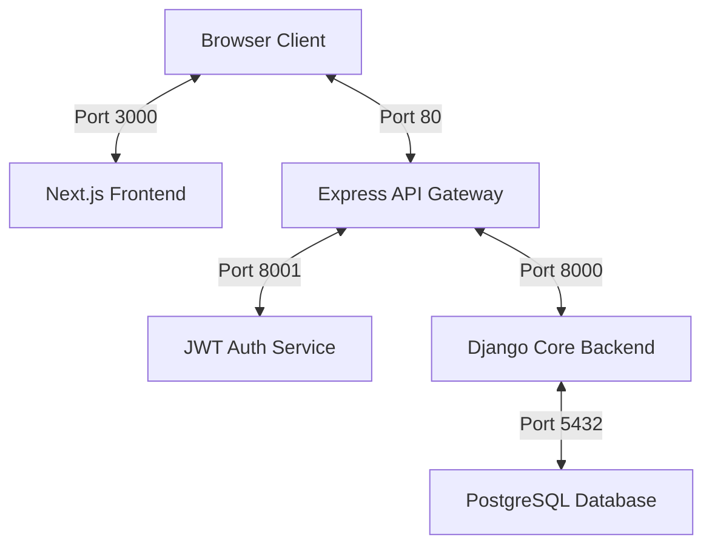

# wtvision System Control Center

Welcome to **wtvision**, a highly decoupled, production-grade microservices system. This repository hosts a multi-service architecture including a Next.js client application, an Express-based API Gateway, a centralized Django JWT Authenticator, and a downstream Django API core backend, all backed by PostgreSQL.

---

## 1. System Architecture

The project consists of 5 unified containerized services designed for high performance, ease of scaling, and absolute separation of concerns.



### Flow of Execution:
1. **Client Interface**: The browser loads the Next.js frontend (`wtvisionfe`).
2. **Authentication Gateway**: All downstream data operations are routed through the central Express API Gateway (`wtvision-gateway`) on port `80`.
3. **Decoupled Identity Verification**: The gateway isolates security logic, directing credential checks to the Python `jwt_authservice` (port `8001`) and standard api requests to the Core Backend `wtvisionbe` (port `8000`).
4. **Data Isolation**: Database transactions are safely isolated in the PostgreSQL container (`wtvision_db`).

---

## 2. Microservices Breakdown

### 📂 [Next.js Frontend (wtvisionfe)](file:///c:/Users/ritam/wtvision/wtvisionfe)
A premium client interface designed with modern developer experience and visual assets.
* **Tech Stack**: Next.js (React), TypeScript, Sass/SCSS, Tailwind CSS v4, PostCSS, Axios.
* **Core Capabilities**:
  * **Unified Auth Context**: Global state management (`AuthContext`) decoupling authentication from presentation.
  * **Secure Axios Private Interceptors**: An automatic token injector (`useAxiosPrivate`) that hooks into outbound requests, adding Bearer tokens and trapping 401 unauthorized errors to execute silent, seamless JWT token rotation without interrupting the user.
  * **Modern Sass `@use` Module Architecture**: Migrated from legacy `@import` styling to the modern, future-proof Dart Sass `@use` spec. Houses a tailored version of the standard **7-1 Sass Pattern** inside `wtvisionfe/styles/`.
  * **Artsy Biscuit Design Theme**: Features a warm, linen-beige blueprint wallpaper (`/botanical_pattern.png`) decorated with premium 2px solid dark brown borders (`#4A2E1B`) on cards, light beige primary buttons (`#BCA385`) that darken on hover (`#A68C6D`), and all text/font renderings strictly locked to pitch black (`#000000`) for high-contrast accessibility.

### 📂 [Express API Gateway (wtvision-gateway)](file:///c:/Users/ritam/wtvision/wtvision-gateway)
The entry point of the backend system running on Port `80`.
* **Tech Stack**: Node.js, Express, HTTP Proxy.
* **Core Capabilities**:
  * Acts as a reverse proxy router.
  * Ensures downstream microservices are completely isolated and never exposed to the public internet.

### 📂 [JWT Auth Microservice (jwt_authservice)](file:///c:/Users/ritam/wtvision/jwt_authservice)
Centralized authentication provider.
* **Tech Stack**: Django, Python, SimpleJWT, PostgreSQL.
* **Core Capabilities**:
  * Issues, encodes, and signs JSON Web Tokens.
  * Uses cryptographic private/public PEM keypairs (`private.pem`, `public.pem`) to sign and verify claims.
  * Rotates authentication access credentials seamlessly.
  * **Secure Registration & Auto-Login**: Custom user registration view with email/username uniqueness constraints, automated post-signup auto-login, and integrated token validation.

### 📂 [Django Core Backend (wtvisionbe)](file:///c:/Users/ritam/wtvision/wtvisionbe)
Downstream business logic API provider.
* **Tech Stack**: Django Rest Framework (DRF), Python, PostgreSQL.
* **Core Capabilities**:
  * Serves authenticated endpoints such as `/api/v1/dashboard/`.
  * Verifies gateway-injected user contexts and processes transactions using a local SQLite database for local development and PostgreSQL for production.

---

## 3. Getting Started

### Prerequisites
Make sure you have [Docker Desktop](https://www.docker.com/products/docker-desktop/) installed on your machine.

### Quick Start (Docker Compose)
You can build and spin up the entire cluster with a single command from the root directory:

```bash
docker-compose up --build
```

This will automatically build and expose:
* **Next.js Frontend**: http://localhost:3000
* **API Gateway Proxy**: http://localhost:80
* **Django Core Backend**: http://localhost:8000
* **JWT Auth Service**: http://localhost:8001
* **PostgreSQL Database**: http://localhost:5432

---

## 4. Manual / Development Startup

If you prefer to run services individually for debugging, follow the steps below:

### 1. Database (PostgreSQL)
Run Postgres on port `5432` or utilize a local database schema.

### 2. JWT Auth Service (Port 8001)
```bash
cd jwt_authservice
python -m venv .venv
# Activate venv (.venv\Scripts\activate on Windows)
pip install -r requirements.txt
python manage.py migrate
python manage.py runserver 0.0.0.0:8001
```

### 3. Downstream Core Backend (Port 8000)
```bash
cd wtvisionbe
python -m venv .venv
# Activate venv (.venv\Scripts\activate on Windows)
pip install -r requirements.txt
python manage.py migrate
python manage.py runserver 0.0.0.0:8000
```

### 4. Express API Gateway (Port 80)
```bash
cd wtvision-gateway
npm install
node server.js
```

### 5. Next.js Client App (Port 3000)
```bash
cd wtvisionfe
npm install
npm run dev
```

---

## 5. Security & JWT Token Rotation
The frontend leverages a custom Axios interceptor to ensure zero session downtime for active users:
* **Access Tokens** are short-lived.
* When an access token expires, any private endpoint call will receive a `401 Unauthorized` response.
* The frontend interceptor captures this error before returning it to the component.
* It hits `/auth/token/refresh/` asynchronously.
* If a new access token is received, the interceptor re-attempts the original request with the fresh token. The user experiences absolutely zero interruptions.
* If the refresh token is also expired, the interceptor forces a clean sign-out, steering the user back to the login page safely.