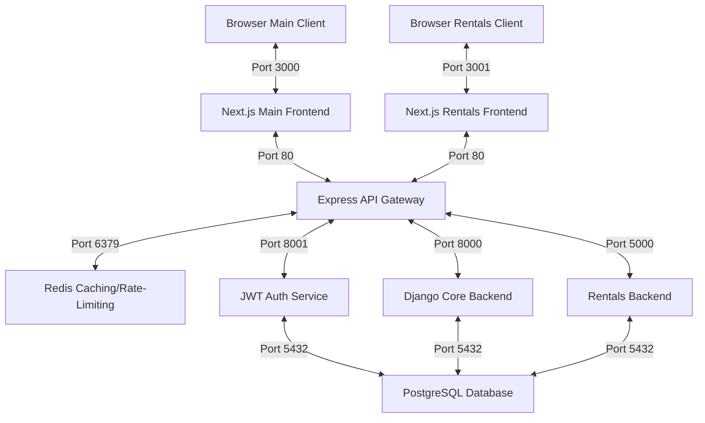

# wtvision System Control Center

Welcome to **wtvision**, a highly decoupled, production-grade microservices system. This repository hosts a multi-service architecture including Next.js client applications, an Express-based API Gateway, a Redis rate-limiting service, a centralized Django JWT Authenticator, a downstream Django API core backend, and a TypeScript/Express Rentals backend, all backed by PostgreSQL.

---

## 1. System Architecture

The project consists of 11 containerized services designed for high performance, ease of scaling, and absolute separation of concerns.



### Flow of Execution:
1. **Client Interfaces**: The browser loads either the Next.js main frontend (`wtvisionfe`) on port `3000` or the Next.js Uniform Rentals portal (`rentals_app/rentals_frontend`) on port `3001`.
2. **Central API Gateway & Rate Limiter**: All downstream API transactions are routed through the central Express API Gateway (`wtvision-gateway`) on port `80`. The Gateway integrates with Redis (`wtvision_redis`) on port `6379` to enforce rate-limiting across authentication and resource APIs.
3. **Decoupled Identity Verification & Edge Decoding**: The API gateway isolates auth/security logic. It directs credentials verification to the Python `jwt_authservice` (port `8001`). For authenticated routes, the Gateway cryptographically decodes incoming JWT access tokens at the edge (using the public PEM key), injects decrypted user context headers (`X-User-Id`, `X-User-Email`, `X-User-Role`) downstream, and strips the original Authorization header to keep downstream services lean.
4. **Service-Specific Routing**:
   - `/auth/*` routes to `jwt_authservice` on port `8001`
   - `/api/v1/rentals/*` routes to the Node.js/TypeScript `rentals_backend` on port `5000`
   - `/api/v1/*` and `/api/public/*` route to the Django core backend `wtvisionbe` on port `8000`
5. **Data Isolation & Storage**: Backend services process transactions using the shared PostgreSQL database (`wtvision_db` container) on port `5432` with service-specific schemas.

---

## 2. Microservices Breakdown

### 📂 [Next.js Main Frontend (wtvisionfe)](file:///c:/Users/ritam/wtvision/wtvisionfe)
A premium client interface designed with modern developer experience and visual assets.
* **Tech Stack**: Next.js (React), TypeScript, Sass/SCSS, Tailwind CSS v4, PostCSS, Axios.
* **Core Capabilities**:
  * **Unified Auth Context**: Global state management (`AuthContext`) decoupling authentication from presentation.
  * **Secure Axios Private Interceptors**: An automatic token injector (`useAxiosPrivate`) that hooks into outbound requests, adding Bearer tokens and trapping 401 unauthorized errors to execute silent, seamless JWT token rotation without interrupting the user.
  * **Modern Sass `@use` Module Architecture**: Migrated from legacy `@import` styling to the modern, future-proof Dart Sass `@use` spec. Houses a tailored version of the standard **7-1 Sass Pattern** inside `wtvisionfe/styles/`.
  * **Artsy Biscuit Design Theme**: Features a warm, linen-beige blueprint wallpaper (`/botanical_pattern.webp`) decorated with premium 2px solid dark brown borders (`#4A2E1B`) on cards, light beige primary buttons (`#BCA385`) that darken on hover (`#A68C6D`), and all text/font renderings strictly locked to pitch black (`#000000`) for high-contrast accessibility.
  * **Optimized Rendering Assets**: Compressed the background wallpaper to a highly optimized WebP format (`/botanical_pattern.webp`) reducing its size by ~85% (from 1.2MB to 183KB) to prevent Docker and browser loading bottlenecks.
  * **Solid White Enclosures**: Wrapped key interface components (the unauthenticated gateway gatekeeper panel and the authenticated Control Center header) inside high-contrast solid white block components (`.white-block`) using a premium 2px border and clean drop shadows.
  * **Unified Backdrop Blur Styling**: Configured standard, responsive backdrop blur filters (`backdrop-filter: blur(...) saturate(130%)`) across all cards (glass cards, white cards, settings cards, and login cards) for high-contrast legibility over the wallpaper.
  * **Client-Side Password Validation**: Implemented forms validation checks preventing password updates if the new password is equal to the current password.

### 📂 [Next.js Rentals Frontend (rentals_frontend)](file:///c:/Users/ritam/wtvision/rentals_app/rentals_frontend)
An artsy frontend service dedicated to uniform rentals, bookings, and digital credentials retrieval.
* **Tech Stack**: Next.js (React 19), TypeScript, Sass/SCSS, Tailwind CSS v4, PostCSS, Axios.
* **Core Capabilities**:
  * **Category & Catalog Listings**: Lists rental uniforms/items categorized dynamically (e.g. Power Tools, Camping Gear, SaaS Memberships).
  * **Proximity Geolocation Sorting**: Allows users to filter and sort available rentals based on GPS coordinates and maximum distance constraints (km).
  * **Dynamic Attribute Inputs**: Dynamically renders card components and form fields matching specific category JSON schemas.
  * **Digital Credentials Delivery**: Manages booking transactions and securely displays decrypted credentials tokens for digital rentals.
  * **Custom Interceptors & Styling**: Connects to the central API gateway on port 80 using secure Axios private instances and rotates access tokens automatically.

### 📂 [Express API Gateway (wtvision-gateway)](file:///c:/Users/ritam/wtvision/wtvision-gateway)
The entry point of the backend system running on Port `80`.
* **Tech Stack**: Node.js, Express, HTTP Proxy, Redis, JWT.
* **Core Capabilities**:
  * Acts as a reverse proxy router.
  * Ensures downstream microservices are completely isolated and never exposed to the public internet.
  * **Redis-Backed Rate Limiting**: Implements strict API request rate limits at the edge via Redis (`rate-limit-redis`).
  * **Edge JWT Authentication & Decoding**: Cryptographically verifies access tokens with an asymmetric public PEM key (`public.pem`), injects user metadata headers (`X-User-Id`, `X-User-Email`, `X-User-Role`), and strips original HTTP Authorization headers before forwarding requests downstream.

### 📂 [Redis Caching Service (redis)](#)
Rate-limiting and caching backend.
* **Tech Stack**: Redis 7 (Alpine).
* **Core Capabilities**:
  * Backs the API Gateway's rate limiters (`apiLimiter` and `authLimiter` via `rate-limit-redis`) to prevent brute-force attacks.

### 📂 [JWT Auth Microservice (jwt_authservice)](file:///c:/Users/ritam/wtvision/jwt_authservice)
Centralized authentication provider.
* **Tech Stack**: Django, Python, SimpleJWT, PostgreSQL.
* **Core Capabilities**:
  * Issues, encodes, and signs JSON Web Tokens.
  * Uses cryptographic private/public PEM keypairs (`private.pem`, `public.pem`) to sign and verify claims.
  * Rotates authentication access credentials seamlessly.
  * **Secure Registration & Auto-Login**: Custom user registration view with email/username uniqueness constraints, automated post-signup auto-login, and integrated token validation.

### 📂 [Django Core Backend (wtvisionbe)](file:///c:/Users/ritam/wtvision/wtvisionbe)
Downstream business logic API provider.
* **Tech Stack**: Django Rest Framework (DRF), Python, PostgreSQL.
* **Core Capabilities**:
  * Serves authenticated endpoints such as `/api/v1/dashboard/`.
  * Verifies gateway-injected user contexts and processes transactions using a local SQLite database for local development and PostgreSQL for production.

### 📂 [Rentals Backend (rentals_backend)](file:///c:/Users/ritam/wtvision/rentals_app/rentals_backend)
Modular micro-backend service managing uniform rentals and booking logic.
* **Tech Stack**: Node.js, Express, TypeScript, Prisma ORM, PostgreSQL.
* **Core Capabilities**:
  * **Prisma Schema & Migrations**: Configured under the `rentals` schema of the central PostgreSQL database.
  * **Dynamic Categories & Items Catalog**: Serves items and categories matching custom JSON schema properties.
  * **Proximity Query Calculations**: Evaluates distance calculations directly inside PostgreSQL query functions.
  * **Secure Symmetric Encryption**: Encrypts and decrypts digital item passwords/tokens using cryptographic keys.

### 📂 [PostgreSQL Database (db)](#)
Central persistent storage cluster.
* **Tech Stack**: PostgreSQL 15 (Alpine).
* **Core Capabilities**:
  * Centralizes persistent database storage for Auth credentials (`credentials_db`), Django tables, and Prisma rentals tables.

### 📂 [Algorithmic Trading Platform (algo_trading)](file:///c:/Users/ritam/wtvision/algo_trading)
A multi-agent autonomous quantitative trading system with risk controls, options hedging, and persistent state training.
* **upstox-learner (Python gRPC Service)**:
  * Tech Stack: Python, gRPC, Flask, Pytest, PostgreSQL.
  * Core Capabilities: Manages the Blackboard-orchestrated agents (Tactician, Explorer, Sentinel, Anchor, Treasurer, Meta-Opt). Executes learning scenarios (bear, bull, chop, flash crash, mixed) and saves state parameters.
* **upstox-backend (Java Spring Boot Service)**:
  * Tech Stack: Java, Spring Boot, gRPC client, JPA, PostgreSQL.
  * Core Capabilities: Coordinates live execution parameters and connects to the Python learner service via gRPC.
* **trading-dashboard (Streamlit Dashboard)**:
  * Tech Stack: Streamlit, Pandas, Plotly.
  * Core Capabilities: Visualizes system performance, NAV history, agent parameter dynamics, and live positions.

---

## 3. Getting Started

### Prerequisites
Make sure you have [Docker Desktop](https://www.docker.com/products/docker-desktop/) installed on your machine.

### Quick Start (Docker Compose)
You can build and spin up the entire cluster with a single command from the root directory:

```bash
docker-compose up --build
```

This will automatically build and expose:
* **Next.js Main Frontend**: http://localhost:3000
* **Next.js Rentals Frontend**: http://localhost:3001
* **API Gateway Proxy**: http://localhost:80
* **Django Core Backend**: http://localhost:8000
* **JWT Auth Service**: http://localhost:8001
* **Rentals Backend**: http://localhost:5000 (proxied via gateway on port 80/api/v1/rentals)
* **Redis Caching/Rate-Limiting**: http://localhost:6379
* **PostgreSQL Database**: http://localhost:5432

---

## 4. Manual / Development Startup

If you prefer to run services individually for debugging, follow the steps below:

### 1. Database (PostgreSQL)
Run PostgreSQL on port `5432` or utilize a local database schema.

### 2. Redis Caching Service
Run Redis on port `6379` locally.

### 3. JWT Auth Service (Port 8001)
```bash
cd jwt_authservice
python -m venv .venv
# Activate venv (.venv\Scripts\activate on Windows)
.venv\Scripts\activate
pip install -r requirements.txt
python manage.py migrate
python manage.py runserver 0.0.0.0:8001
```

### 4. Downstream Core Backend (Port 8000)
```bash
cd wtvisionbe
python -m venv .venv
# Activate venv (.venv\Scripts\activate on Windows)
.venv\Scripts\activate
pip install -r requirements.txt
python manage.py migrate
python manage.py runserver 0.0.0.0:8000
```

### 5. Rentals App Backend (Port 5000)
```bash
cd rentals_app/rentals_backend
npm install
npx prisma db push
npm run dev
```

### 6. Express API Gateway (Port 80)
```bash
cd wtvision-gateway
npm install
node server.js
```

### 7. Next.js Main Client App (Port 3000)
```bash
cd wtvisionfe
npm install
npm run dev
```

### 8. Next.js Rentals Client App (Port 3001)
```bash
cd rentals_app/rentals_frontend
npm install
npm run dev
```

---

## 5. Security & JWT Token Rotation
The frontend leverages a custom Axios interceptor to ensure zero session downtime for active users:
* **Access Tokens** are short-lived.
* When an access token expires, any private endpoint call will receive a `401 Unauthorized` response.
* The frontend interceptor captures this error before returning it to the component.
* It hits `/auth/token/refresh/` asynchronously.
* If a new access token is received, the interceptor re-attempts the original request with the fresh token. The user experiences absolutely zero interruptions.
* If the refresh token is also expired, the interceptor forces a clean sign-out, steering the user back to the login page safely.